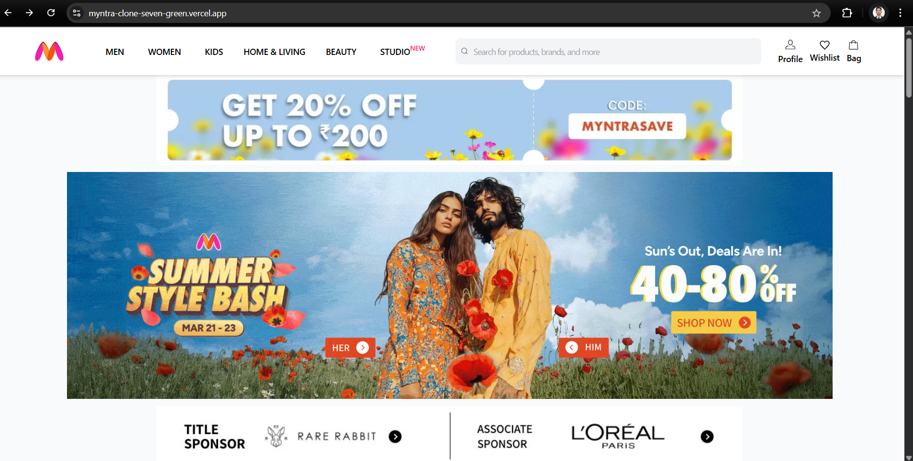
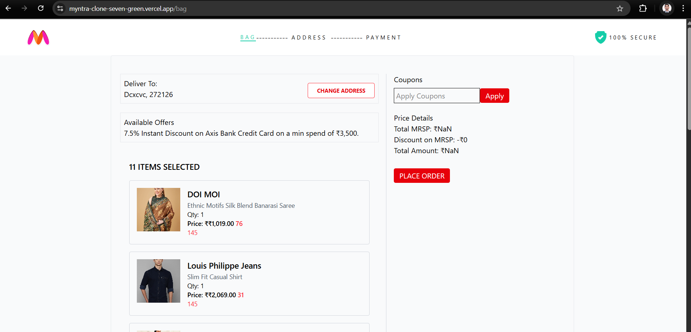

# 🛍️ Myntra Clone

A scalable full-stack **e-commerce web application** inspired by **Myntra**, built using modern web technologies. This project offers user-friendly UI, secure authentication, product management, cart, and order functionalities — designed for a seamless online shopping experience.

## 🧰 Tech Stack

### 🚀 Backend
- Node.js
- Express.js
- MongoDB
- Mongoose
- JWT Authentication

### ⚡ Frontend
- React.js
- Tailwind CSS
- Axios
- React Router DOM
- Redux Toolkit
- CreateApi
---

## ✨ Features

- 🔐 User Authentication (Register, Login with JWT)
- 🛍️ Product Listing & Details
- 🛒 Add to Cart / Remove from Cart
- 📦 Place Orders
- 📃 Order Summary & History
- 📱 Fully Responsive Design
- 🧾 Clean and modular code structure

---

## 📸 Screenshots

> 
> 

---

## 🛠️ Installation

### Clone the repository
```bash
git clone https://github.com/Amarjeet5822/myntra-clone
cd myntra-clone

